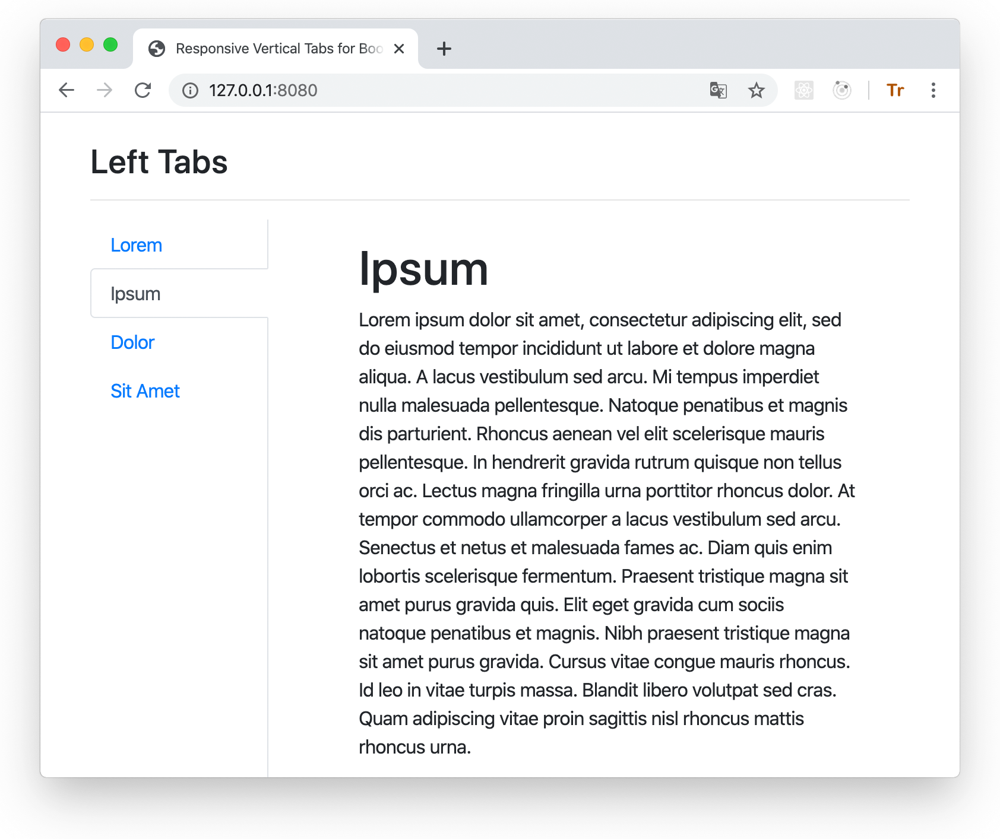

# Responsive Vertical Navigation Tabs for Boostrap 4

[](https://travis-ci.org/tromgy/bootstrap-4-vertical-tabs)


A stylesheet that implements vertically-oriented navigation tabs with Bootstrap 4.



This package was inspired by the [original](https://github.com/dbtek/bootstrap-vertical-tabs) bootstrap vertical tabs.

However, that package does not work with Bootstrap 4.

## Installation

This package depends on Bootstrap 4, so it is assumed that you already have it installed and/or included
in your HTML.

You can use this package either by directly embedding its pre-built stylesheet in your HTML **after the boostrap styles** like this:

```HTML
<TBD>
```

or (recommended) install and build it yourself:

```bash
npm install bootstrap-4-vertical-tabs node-sass node-sass-import --save-dev
```

## Building

This assumes that you use SCSS stylesheets.

### 1. In your stylesheet either:

```SCSS
@import "bootstrap-4-vertical-tabs/custom-variables";
@import "bootstrap-4-vertical-tabs/scss/responsive-vertical-tabs";
```

### or (recommended) define your own values for the custom variables, and then `@import` **responsive-vertical-tabs.scss**.

It requires the following variables to be defined:

- `$vertical-tabs-min` - this value specifies the minimum view width for display of vertical tabs, below this width vertical
tabs turn into regular horizontal tabs:


- `$horizontal-tabs-min` - if the view is narrower than this value, horizontal tabs turn into nav-pills-like buttons:


- `$fixed-tab-size` - specify this based on the expected text length to be displayed on the tabs.
A (long) text that (always) fits into a vertical tab, will get ellipsis-_ed_ when it doesn't fit into
horizontal or sideways tabs:

Vertical                                                                      | Horizontal                                                                            | Sideways
------------------------------------------------------------------------------|---------------------------------------------------------------------------------------|------------------------------------------------------------------------------------------------
||

changing the value of this variable can allow you to control if and how tab captions might be truncated. The recommended values are between 4 and 12 rem.

- `$left-tabs-text-align` and `$right-tabs-text-align` - these specify the text alignment for vertical left/right tabs. 
When tabs are displayed as horizontal or nav-pills, the text is always center-aligned.

Check the **custom-variables.scss** stylesheet for the default values.

### 2. Compile with node-sass

```bash
npx node-sass --importer node_modules/node-sass-import <input>.scss <output>.css
```

## Usage

There are 3 classes defined in the stylesheet which should be applied to the element having `nav-tabs` bootstrap class:
`left-tabs`, `right-tabs`, and `sideways-tabs`:

Left                                           | Right
:----------------------------------------------|-------------------------------------------------:
`left-tabs`                                    |                                     `right-tabs`
         |          
`sideways-tabs` (with `left-tabs`)             |              `sideways-tabs` (with `right-tabs`)
| 

The **index.html** file in this directory illustrates all four styles.
